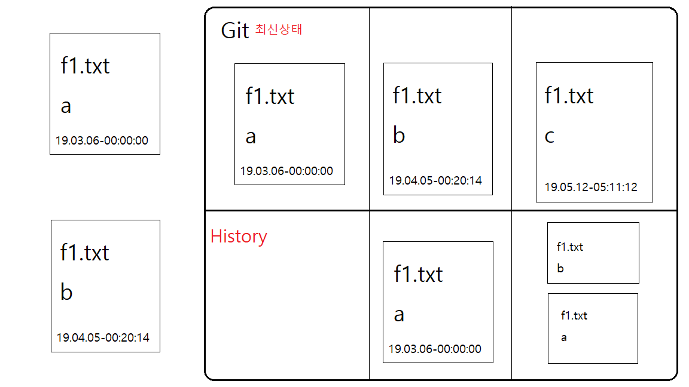

<h3>글을 시작하기 앞서..</h3>
이고잉(egoing)님의 '생활코딩'으로 공부를 하면서 처음에는 웹호스팅을 위한것으로 Github를 처음 접했다.  
당시 단순히 "웹 호스팅을 서비스 해주는 웹사이트구나" 라고 생각을 했었다. 그런데 개발공부 하면 할 수록 Github는 단순한 웹 호스팅사이트가 아니며, Git이라는 버전관리시스템에서 기반된 원격저장소라는것을 알게되었다. 뿐만 아니라, Github를 통해 오픈소스 프로젝트를 참여하며 그 오픈소스에 기여(Contribute)할수있다는 것을 알게되었다.    오늘날은 '대 오픈소스의 시대'이다. 그 오픈소스에 내가 '기여'를 할 수 있다는 것은 실력과 경험을 쌓아 갈 수있는, 쌓았다는 가장 큰 지표가 아닐까? 따라서 나는 오픈소스라는 거대한 '바다'에 빠지기 위해 Git에 대해 공부하려고 한다. 이 글은 개인적인 공부를 위한 글이기때문에 사실 전문적이지도, 정확하지도 않을 수 있으며, 부족한 점이 많을 것이다. 이 글을 읽는 독자가 있다면 참고바란다. 공부에 대한 기본적 참고는 이고잉님의 '생활코딩'에서 참고한 내용으로 글을 시작하려 한다.    글을 시작하기 앞서, '생활코딩'의 이고잉(egoing)님에게 감사와 존경을 표한다. 

***
<h2>Git이란?</h2>

 Git은 간단히 말해 버전관리시스템(Version Control System)중 하나인 시스템이다. 그렇다면 버전관리는 무엇이고, 우리는 왜 버전관리시스템을 써야 할까?    어떤 형태로든 소스 코드를 백업하여 분실의 위험에서 보호하고 개정 전후 내용을 파악하여 추후 발생할지도 모를 오류수정에 대비하는 절차가 필요한데, 앞서 말한 <u>발생할 여러 문제들에 대해 소스코드를 보호하고, 대비 할 수있는 시스템, 파일의 변화를 시간에 따라 기록하여 과거 특정 시점의 버전을 다시 불러올 수 있는 시스템, 프로젝트에서 발생하는 다양한 이슈들을 추적하는 시스템</u>이 바로 **버전관리시스템(Version Control System)**이다.   
 오늘날 CVS, SVN 등 많은 버전관리시스템이 있지만 그 중에서도 가장 많이 사용되고 있는 버전관리시스템이 바로 Git이다. 다른 버전관리시스템이랑 큰 차이점은 무엇일까? 원리적인 측면 등 여러 차이점이 있겠지만서도, 개인적으로 생각하는 차이점은 버전관리 뿐만 아니라 원격 저장소(Github)를 통해 '협업'을 할 수있다는 점이다. 즉 오늘날 '대 오픈소스시대'에 누구나 접근이 가능하고 개발이 가능한 가장 알맞은 발전적 버전관리시스템이 아닐까?   

***
 <h2>Git의 기본적 개념</h2>

 간단한 그림으로 버전관리시스템 개념를 알아보자. 
   위에 그림의 예시처럼 f1.txt 파일이 있다고 가정하고, Git을 이용해 버전관리에 들어간다. 같은 파일명인 상태로 파일내용만을 변경한다. 단순히 생각한다면, 이전 파일 위에 덮어쓰기를 하여 최신버전의 상태를 이룬다고 생각하면 이해가 쉽게 될것이다. 그러나 여기서 가장 중요한 핵심은 **이전 파일의 내용이 history에 남아있다는 점이다.** 버전관리시스템(Version Control System)을 이용하지 않은 보통의 파일을 덮어쓰기 한다면, 이전 파일내용 위에 그대로 최신파일의 내용이 덮어쓰여지기 때문에 이전파일의 내용을 복원하기가 힘들다. 반면에 버전관리시스템(Version Control System)을 이용하게 된다면 이전 파일의 내용이 history에 남아있어 이전 파일의 내용을 쉽게 불러올 수 있다. 이런 원리로 소스코드의 손실, 개정 전 후의 내용파악 등이 쉽게 가능할 수 있게 되는것이다.    버전관리시스템의 기본적 개념은 얼마나 간단한가?
<ul><li>파일을 덮어씌운다.</li>
<li>덮어씌여진 이전 파일의 내용을 복원할 수 있다.</li></ul>

 
>간단한 것이 가장 위대하다.

라는 말을 들은적이 있다. 이토록 간단한 개념을 가진 Git은 실제 개발에 있어서 파급력은 엄청나다. 실제로 버전관리시스템이 없이 수천, 수억개로 이루어진 소스코드들에 변경사항들을 파악하고, 소스코드들의 손실을 막아 단 한번의 오류없이 유지보수를 한다는 것은 불가능에 가깝다. 그 불가능을 가능하게 만들어준 버전관리시스템 Git   
오늘날은 프로그래밍에 관해서만 이루어지고있지만, 여기서 끝나는게 아니라 이러한 개념을 갖은 Git이 좀 더 넓은 분야까지 파고든다면 어떻게 될까? 여러 번의 수정을 통해 최고의 글을 써내려 가야하는 소설가 혹은 작가, 여러 번의 수정을 통해 최고의 레시피를 탄생시키는 요리사, 여러 번의 수정을 통해 멋진 작품들을 만들어내는 디자이너 등 수도 없이 많을 것이다. 우리가 이전 내용을 기억하고, 수정하고 그 바탕으로 새로운 것들을 창조해 낼때 가장 빛을 바랄것이다. 이 얼마나 멋진 일인가?   

기본적인 개념에 대해서는 여기까지 알아보고 다음 글에서는 좀 더 세부적인 원리를 알아보자.

---

 
<h3>Reference</h3>
<ul>
  <li>생활코딩 [지옥에서 온 Git] : <a href="https://opentutorials.org/course/2708">https://opentutorials.org/course/2708</a></li>
  <li>Git-scm : <a href="https://git-scm.com/">https://git-scm.com/</a></li>
  <li>위키백과 - 버전관리 : <a href="https://ko.wikipedia.org/wiki/%EB%B2%84%EC%A0%84_%EA%B4%80%EB%A6%AC">https://ko.wikipedia.org/wiki/</a></li>
  <li>Hojong Blog : <a href="https://ho1234c.github.io/">https://ho1234c.github.io/</a></li>
</ul>
